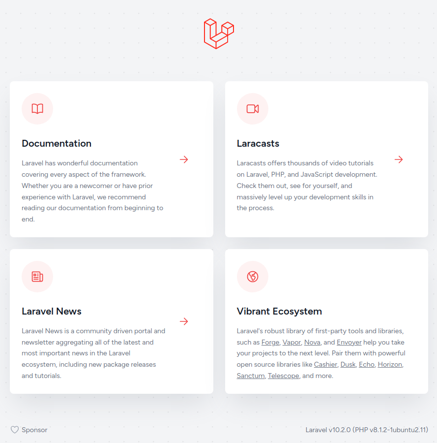

# PHP: Hypertext Preprocessor

- Ubuntu 22.04

## [Install PHP](https://www.php.net/manual/en/install.unix.debian.php#install.unix.debian.apt)

```sh
# apt install php
apt install php-common libapache2-mod-php php-cli php-curl php-dom
```

```sh
php --version
# PHP 8.1.2-1ubuntu2.11 (cli) (built: Feb 22 2023 22:56:18) (NTS)
```

## Composer

PHP 패키지 관리자

### Install

```sh
curl -sS https://getcomposer.org/installer | sudo php -- --install-dir=/usr/local/bin --filename=composer
```

```sh
# All settings correct for using Composer
# Downloading...

# Composer (version 2.5.4) successfully installed to: /usr/local/bin/composer
# Use it: php /usr/local/bin/composer
```

```sh
composer --version
# Composer version 2.5.4 2023-02-15 13:10:06
```

- [공식 문서](https://getcomposer.org/download/)는 아래와 같지만 복잡함

```sh
php -r "copy('https://getcomposer.org/installer', 'composer-setup.php');"
php -r "if (hash_file('sha384', 'composer-setup.php') === '55ce33d7678c5a611085589f1f3ddf8b3c52d662cd01d4ba75c0ee0459970c2200a51f492d557530c71c15d8dba01eae') { echo 'Installer verified'; } else { echo 'Installer corrupt'; unlink('composer-setup.php'); } echo PHP_EOL;"
# Installer verified
php composer-setup.php
# All settings correct for using Composer
# Downloading...

# Composer (version 2.5.4) successfully installed to: /home/mark/composer.phar
# Use it: php composer.phar
sudo mv composer.phar /usr/local/bin/composer
```

### Update

```sh
composer self-update
```

## Laravel

PHP Framework for Web Artisans.

Laravel Installer를 설치한다.

```sh
composer global require laravel/installer
```

composer global은 다음 경로에 설치하기 때문에 PATH를 설정해야 한다.

```sh
export PATH=$PATH:$HOME/.config/composer/vendor/bin
```

```sh
laravel --version
# Laravel Installer 4.4.2
```

Laravel 프로젝트를 생성한다.

```sh
laravel new demo-laravel
```

```sh
cd demo-laravel
```

```sh
composer install
# 설치 시 에러가 발생할 경우
composer install --ignore-platform-reqs
```

서버를 실행한다.

```sh
php artisan serve
# Server running on [http://127.0.0.1:8000].
```



아티즌(Artisan)은 라라벨에 포함된 커맨드라인 인터페이스(CLI)의 이름입니다.
Artisan은 `artisan` 스크립트 파일로 애플리케이션의 최상위 폴더에 존재하며
애플리케이션을 빌드하는 동안 도움이 될 수있는 여러가지 유용한 명령을 제공합니다.
실행가능한 아티즌 명령어 목록을 확인하려면 `list` 명령어를 입력하면 됩니다.
([Laravel Korea](https://laravel.kr/docs/9.x/artisan))

```sh
php artisan list
```
